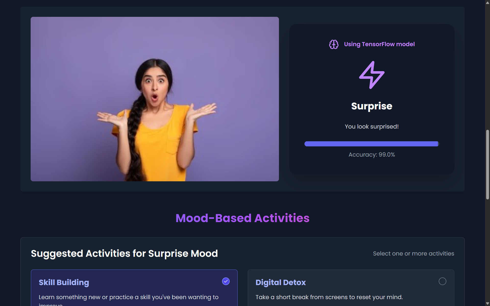

# Emojify 🎭💡

**Emojify** is an intelligent emotion-aware activity recommender powered by facial emotion recognition and mood-based AI suggestions. It uses DeepFace for emotion detection and dynamically recommends meaningful activities to match your current mood.

---

## 🌟 Features

* 🎯 **Emotion Detection**: Detects your emotion in real-time using your webcam or image input (DeepFace model).
* 🧠 **Mood-Based Recommendations**: Suggests activities tailored to your detected mood.
* 🔁 **Activity Customization**: Choose and customize activity durations.
* 💬 **Interactive Chatbot**: AI assistant for more activity suggestions or mood support.
* 🎨 **Beautiful UI**: Dark-themed, engaging interface built for a calm and focused experience.

---

## 📸 Screenshots

### 🏠 Home Page

### 😲 Emotion Detection (Using DeepFace)

### 🧩 Suggested Activities Based on Mood

### 🤖 Chat Support for Extra Recommendations

---

## 🚀 How It Works

1. **Capture or Upload Image** - The system detects your facial expression.
2. **Emotion Recognition** - DeepFace identifies the most prominent emotion (e.g., Surprise, Happy, Sad).
3. **Activity Generation** - Based on your emotion, relevant mood-based activities are displayed.
4. **AI Chat Suggestions** - If you want more options, the AI chatbot offers alternatives.

---

## 🛠️ Tech Stack

* **Frontend**: React, Tailwind CSS
* **Backend**: Flask, TensorFlow/DeepFace
* **ML/AI**: DeepFace, NLP-based suggestion logic
* **Deployment**: Vercel / Local

---

## 🔮 Future Plans

* Add voice-based emotion detection
* Activity analytics dashboard
* User mood history timeline

---

> Made with 💜 by Himanshu Kumawat & Prayanjali Sharma.
